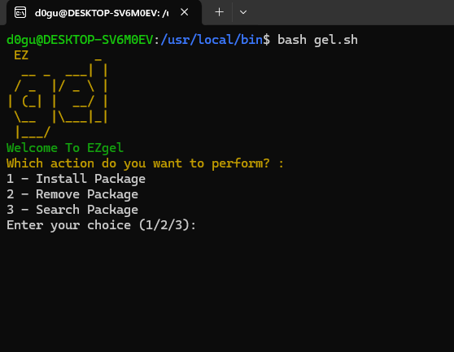

# EZgel
EZgel is a tool that makes it easier to use the gel package manager developed for ArusOS.

# How to Install?
My friend, even our name is easy, all you have to do is install ArusOS and type ezgel through the terminal.

# Screenshot

